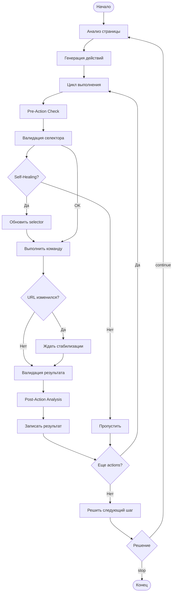

# Action Flow - Упрощенная диаграмма

```mermaid
flowchart TD
    Start([Начало]) --> Analyze[Анализ страницы]
    Analyze --> Generate[Генерация действий]
    Generate --> Loop[Цикл выполнения]

    Loop --> PreCheck[Pre-Action Check]
    PreCheck --> Validate[Валидация селектора]
    Validate --> Healing{Self-Healing?}
    Healing -->|Да| Update[Обновить selector]
    Healing -->|Нет| Skip[Пропустить]
    Update --> Execute[Выполнить команду]
    Validate -->|OK| Execute

    Execute --> Wait{URL изменился?}
    Wait -->|Да| Stabilize[Ждать стабилизации]
    Wait -->|Нет| ValidateResult
    Stabilize --> ValidateResult[Валидация результата]

    ValidateResult --> PostAnalysis[Post-Action Analysis]
    PostAnalysis --> Record[Записать результат]
    Record --> More{Еще actions?}
    More -->|Да| Loop
    More -->|Нет| NextStep[Решить следующий шаг]

    NextStep --> Decision{Решение}
    Decision -->|continue| Analyze
    Decision -->|stop| End([Конец])
    Skip --> More
```
